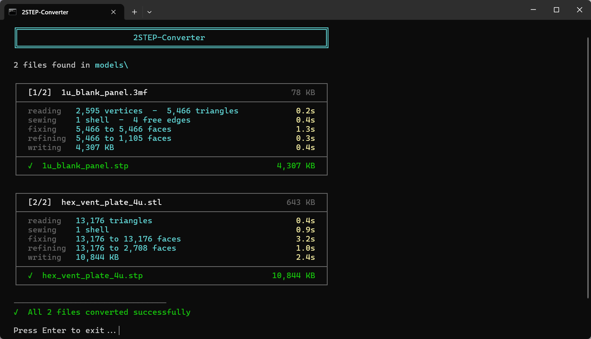
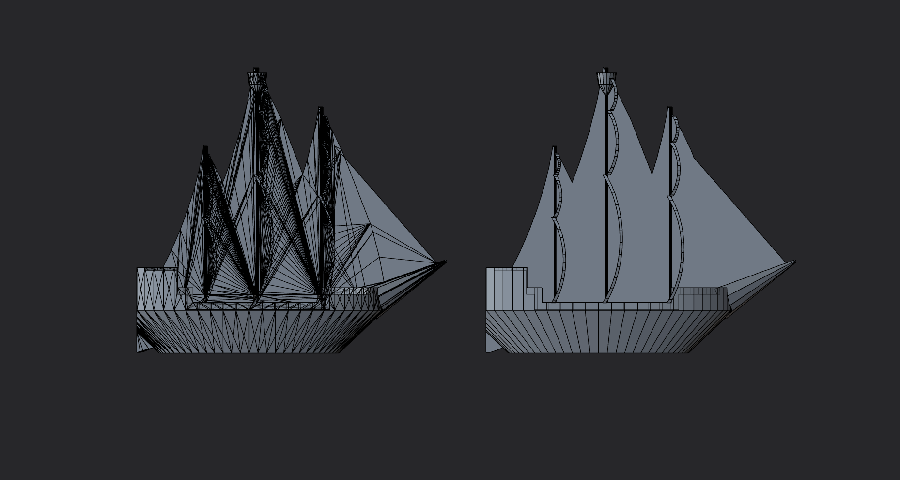

# 2STEP-Converter

> Batch-converts **STL, 3MF, OBJ, AMF, and IGES** files to clean STEP solids using OpenCASCADE Technology - the same engine that powers FreeCAD, CATIA, and other professional CAD tools.




---

The name has a deliberate double meaning. **"to STEP"** - whatever format you throw at it, the output is always a clean STEP file ready to open in any CAD application. **"two steps"** - because that is genuinely all it takes: drop your files into the `models/` folder and run the launcher for your platform. No command line, no configuration, no manual conversion pipeline.

STL, 3MF, OBJ, AMF, IGES - all of these end up as the same problem: a mesh or surface description that needs to become a clean, usable solid. This tool handles all of them the same way, using the same pipeline that FreeCAD uses internally.

This was a fun little project built to fulfil my own needs, so there may be bugs or edge cases - feel free to open an issue or contribute a fix.

**No installation required.** Everything downloads automatically on first run.

---

## Output Quality

Most online converters wrap the mesh as-is into a STEP container, leaving you with thousands of flat triangular faces instead of real solid geometry. 2STEP-Converter uses OpenCASCADE to sew the mesh into a proper solid, repair it, and merge co-planar faces - the same pipeline FreeCAD uses internally.



*Left: result from a typical online converter. Right: converted with 2STEP-Converter. Same source file.*

---

## Usage

### Batch mode

1. Drop your files into the `models/` folder
2. Run the launcher for your platform:
   - **Windows:** double-click `2STEP-Converter.bat`
   - **macOS / Linux:** `./2STEP-Converter.sh` (make executable once with `chmod +x 2STEP-Converter.sh`)
3. Output `.stp` files appear in the same folder

**Supported input formats:** `.stl` `.3mf` `.obj` `.amf` `.igs` `.iges`

### Single file

**Windows**
```bat
2STEP-Converter.bat path\to\model.stl
2STEP-Converter.bat path\to\model.3mf
2STEP-Converter.bat path\to\model.obj
2STEP-Converter.bat path\to\model.amf
2STEP-Converter.bat path\to\model.igs
2STEP-Converter.bat path\to\model.igs path\to\output.stp
```

**macOS / Linux**
```sh
./2STEP-Converter.sh path/to/model.stl
./2STEP-Converter.sh path/to/model.3mf
./2STEP-Converter.sh path/to/model.obj
./2STEP-Converter.sh path/to/model.amf
./2STEP-Converter.sh path/to/model.igs
./2STEP-Converter.sh path/to/model.igs path/to/output.stp
```

### Tolerance option

**Windows**
```bat
2STEP-Converter.bat --tolerance 0.005 model.stl
```

**macOS / Linux**
```sh
./2STEP-Converter.sh --tolerance 0.005 model.stl
```

Default tolerance is `0.01`. Lower = tighter seams, slower processing. Increase if sewing fails on coarse meshes.

---

## First Run

On first launch the launcher automatically downloads everything needed:

| Download | Size | Purpose |
|----------|------|---------|
| micromamba | ~10 MB | Portable Python environment manager |
| Python 3.12 + pythonocc-core | ~6 GB | OpenCASCADE bindings |

### Install location

The launcher checks for an existing environment in this order:

1. `lib/` next to the script - used automatically if present (portable mode)
2. Platform default - used automatically if present
3. Neither found - you are asked where to install

| Platform | Default install path |
|----------|---------------------|
| Windows | `%LOCALAPPDATA%\STLtoSTP` |
| macOS | `~/Library/Application Support/STLtoSTP` |
| Linux | `~/.local/share/STLtoSTP` (respects `$XDG_DATA_HOME`) |

### Windows 260-character path limit

The Python environment contains deeply nested paths that can exceed Windows' default 260-character limit, causing silent failures. On startup the launcher detects this and offers two options:

| Option | What it does |
|--------|-------------|
| **[1] Enable long paths + reboot** | Writes `LongPathsEnabled = 1` to the registry via a UAC prompt, then reboots in 10 seconds. |
| **[2] Use %LOCALAPPDATA%\STLtoSTP** | Installs under your user profile where paths are shorter. No reboot needed. |

To enable long paths manually in an elevated PowerShell:

```powershell
Set-ItemProperty -Path "HKLM:\SYSTEM\CurrentControlSet\Control\FileSystem" -Name LongPathsEnabled -Value 1
```

Then reboot. This limitation does not apply to macOS or Linux.

---

## How It Works

Replicates the FreeCAD **Part workbench** conversion pipeline exactly:

| Step | Operation | OpenCASCADE API |
|:----:|-----------|-----------------|
| 1 | Read input mesh (STL / 3MF / OBJ / AMF / IGES) | `StlAPI_Reader`, `IGESControl_Reader` |
| 2 | Sew triangles into a watertight solid | `BRepBuilderAPI_Sewing` |
| 3 | Repair invalid geometry | `ShapeFix_Shape` |
| 4 | Merge co-planar faces | `ShapeUpgrade_UnifySameDomain` |
| 5 | Export STEP AP203 | `STEPControl_Writer` |

---

## Configuration

All tunable constants live in `config.py`. If the file is missing it is created automatically on first run with the defaults below.

| Constant | Default | Description |
|----------|:-------:|-------------|
| `DEFAULT_TOLERANCE` | `0.01` | Sewing tolerance in model units. Controls how far apart two triangle edges can be and still be joined. |
| `ANGULAR_TOLERANCE` | `1e-3` | Angular tolerance (radians) for merging co-planar faces. ~0.06 deg - catches imprecise flat faces without merging genuinely separate ones. |
| `MODELS_DIR_NAME` | `"models"` | Folder scanned for input files in batch mode. |
| `STL_EXT` | `".stl"` | STL input extension. |
| `TMF_EXT` | `".3mf"` | 3MF input extension. |
| `OBJ_EXT` | `".obj"` | OBJ input extension. |
| `IGS_EXT` | `".igs"` | IGES input extension (`.iges` also accepted). |
| `AMF_EXT` | `".amf"` | AMF input extension. |
| `STP_EXT` | `".stp"` | Output file extension. |

---

## Requirements

- Windows 10/11, macOS (Intel & Apple Silicon), or Linux (x86_64 & ARM64)
- Internet connection on first run only
- ~6 GB free disk space

Converted STEP files have been tested in **Plasticity** and import correctly.

---

## Project Structure

```
2STEP-Converter.bat       - launcher for Windows: auto-setup + run
2STEP-Converter.sh        - launcher for macOS / Linux: auto-setup + run
converter.py              - converter script
config.py                 - tunable constants
models/                   - drop input files here (.stl .3mf .obj .amf .igs .iges)
lib/                      - auto-created: portable Python environment
```

---

## Contributing

Contributions are welcome. Feel free to open a pull request, report issues, or fork and adapt the project to your own needs.

## License

[MIT](LICENSE.md) © 2026 [YaneonY](https://github.com/yaneony/2STEP-Converter)
