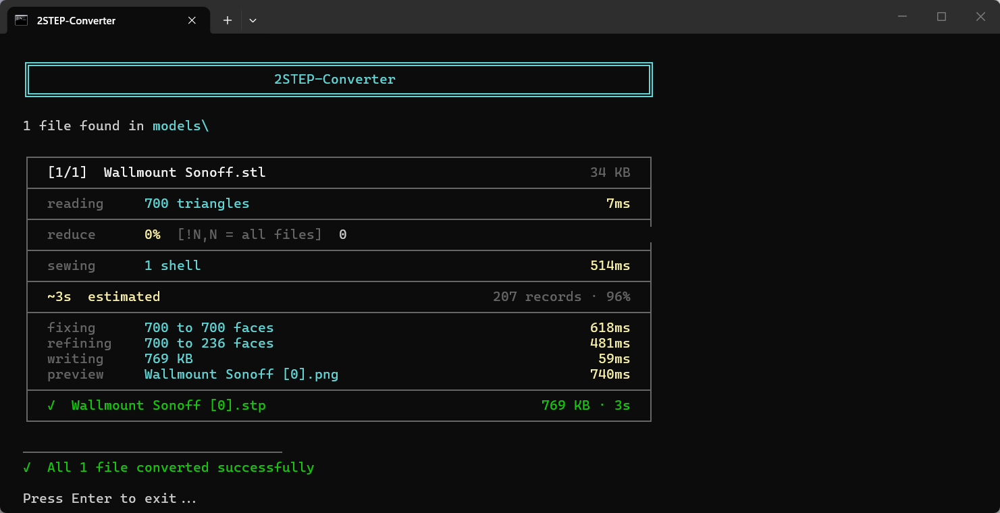
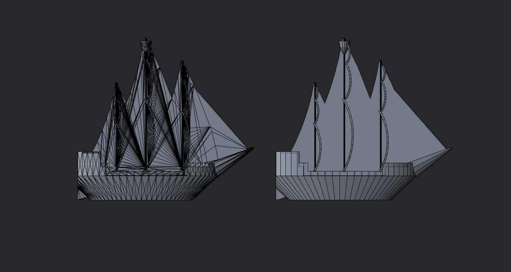
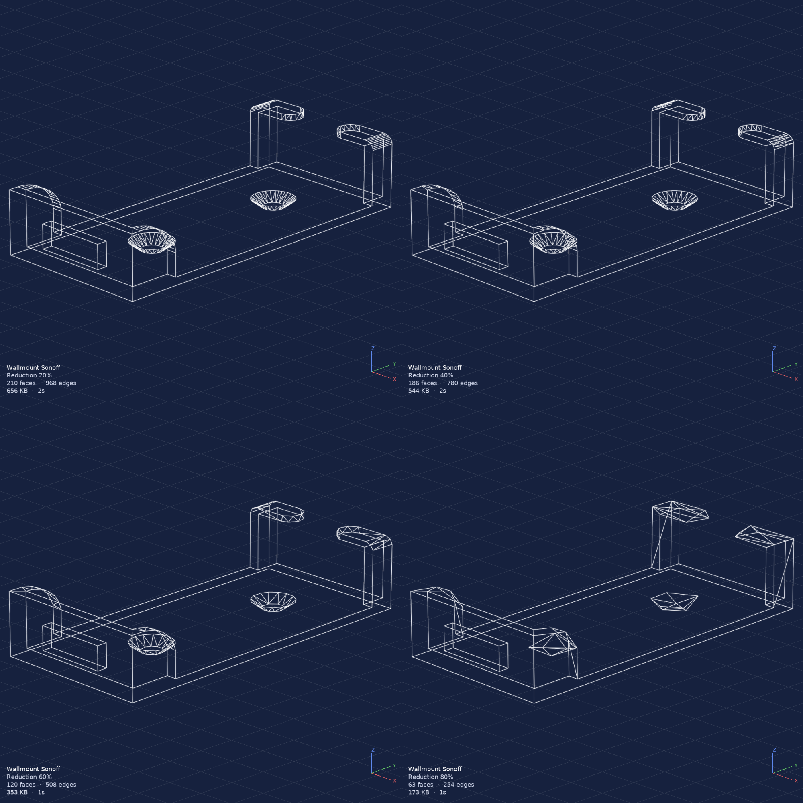

# 2STEP-Converter


Added Dockerfile and Simple UI for running this remotely on a Server with Docker

---

> Converts **STL, 3MF, OBJ, AMF, and IGES** files to clean STEP solids using OpenCASCADE - the same engine that powers FreeCAD, CATIA, and other professional CAD tools.




If this project helps you, you can support development on Ko-fi:

[](https://ko-fi.com/yaneony)

---

The name has a deliberate double meaning: **"to STEP"** - whatever format you throw at it, the output is always a clean STEP file - and **"two steps"** - drop your files into `models/`, run the launcher. Unlike online converters that wrap the mesh as-is in a STEP container (leaving thousands of flat triangular faces), 2STEP-Converter sews the mesh into a proper solid, repairs it, and merges co-planar faces - the same pipeline FreeCAD uses internally.

> [!TIP]
> **Self-contained.** No system Python, no admin rights, no PATH changes. The launcher creates a portable environment that downloads everything it needs on first run.



*Left: typical online converter. Right: 2STEP-Converter. Same source file.*



*Auto-generated `.png` previews showing the same model at 20%, 40%, 60%, and 80% reduction.*

---

## Table of Contents

- [Installation](#installation)
- [Usage](#usage)
- [First Run](#first-run)
- [How It Works](#how-it-works)
- [Configuration](#configuration)
- [Troubleshooting](#troubleshooting)
- [Limitations](#limitations)
- [Requirements](#requirements)
- [Project Structure](#project-structure)
- [Credits](#credits)
- [Disclaimer](#disclaimer)
- [License](#license)

---

## Installation

No system Python required - the launcher creates a self-contained portable environment on first run.

1. **Download** the project:
   - Click the green **Code** button on the [repository page](https://github.com/yaneony/2STEP-Converter) and choose **Download ZIP**
   - Or grab the latest tagged release from [Releases](https://github.com/yaneony/2STEP-Converter/releases)
   - Or clone with git: `git clone https://github.com/yaneony/2STEP-Converter.git`

2. **Extract** the archive to a folder of your choice. Keep the path short on Windows (e.g. `C:\Tools\2STEP-Converter`) to avoid the 260-character path limit - see [Windows 260-character path limit](#windows-260-character-path-limit).

3. **Run the launcher.** First launch auto-installs micromamba and all dependencies (~7.5 GB on disk, 5-15 min depending on connection speed):
   - **Windows** - double-click `2STEP-Converter.bat`
   - **macOS / Linux** - make executable once with `chmod +x 2STEP-Converter.sh`, then `./2STEP-Converter.sh`

4. The launcher will ask once where to install the Python environment: **portable** (next to the script in `lib/`) or **platform default** (under your user profile). See [Install location](#install-location) for the exact paths and trade-offs.

5. Once the environment is built, drop input files into `models/` and run the launcher again - or pass files on the command line. See [Usage](#usage).

> [!TIP]
> No admin rights are required unless you opt into enabling Windows long paths during install. See [First Run](#first-run) for what gets downloaded and where it lives on disk.

---

## Usage

### Batch mode

1. Drop files into the `models/` folder
2. Run the launcher:
   - **Windows** - double-click `2STEP-Converter.bat`
   - **macOS / Linux** - `./2STEP-Converter.sh` (one-time `chmod +x 2STEP-Converter.sh`)
3. Output `.stp` files appear in the same folder

**Supported formats:** `.stl` `.3mf` `.obj` `.amf` `.igs` `.iges`

### Single file

**Windows**
```bat
2STEP-Converter.bat model.stl
2STEP-Converter.bat model.stl -o out.stp
```

**macOS / Linux**
```sh
./2STEP-Converter.sh model.stl
./2STEP-Converter.sh model.stl -o out.stp
```

### Multiple files

Pass any number of files directly - no need to use the `models/` folder:

**Windows**
```bat
2STEP-Converter.bat a.stl b.obj c.3mf
```

**macOS / Linux**
```sh
./2STEP-Converter.sh a.stl b.obj c.3mf
```

### Options

| Option | Default | Description |
|--------|:-------:|-------------|
| `--tolerance` / `-t` | `0.01` | Sewing tolerance in model units. Lower = tighter seams, slower. Increase if sewing fails on coarse meshes. |
| `--reduce` / `-r` | off | Reduce mesh by this % of triangles (e.g. `10` keeps 90%). Comma-separated values produce one output per value (e.g. `25,50,75` writes three `.stp` files). |
| `--output` / `-o` | - | Output file path (single-file mode only). |
| `--output-dir` / `-d` | - | Write all outputs to this directory instead of alongside the source. |
| `--format` | `ap203` | STEP schema: `ap203`, `ap214`, or `ap242`. |
| `--force` / `-f` | off | Re-convert even if the output is already newer than the source. |
| `--dry-run` / `--dry` | off | Show what would be converted or skipped without doing anything. |
| `--watch` / `-w` | off | After the initial batch run, watch `models/` and convert new files as they appear. Ctrl+C to stop. |
| `--preview` / `--no-preview` | from config | Force the `.png` preview on or off (overrides `GENERATE_PREVIEW`). |

> [!NOTE]
> Output files are named `<source> [N].stp` where `N` is the reduction percentage (`0` if no reduction was applied).

**Windows**
```bat
2STEP-Converter.bat --reduce 25 model.stl
2STEP-Converter.bat --reduce 25,50,75 model.stl
2STEP-Converter.bat --format ap214 -d C:\out model.stl
2STEP-Converter.bat --no-preview --dry-run
2STEP-Converter.bat --watch
```

**macOS / Linux**
```sh
./2STEP-Converter.sh --reduce 25 model.stl
./2STEP-Converter.sh --reduce 25,50,75 model.stl
./2STEP-Converter.sh --format ap214 -d ~/out model.stl
./2STEP-Converter.sh --no-preview --dry-run
./2STEP-Converter.sh --watch
```

### Interactive reduction prompt

When `REDUCE_INTERACTIVE` is enabled (default), each batch file pauses on a reduction prompt:

| Input | Result |
|-------|--------|
| **Enter** | Accept the default (from `DEFAULT_REDUCE` or `--reduce`) |
| `25` | Reduce this file by 25% |
| `25,50,75` | Generate three outputs at 25%, 50%, and 75% reduction |
| `!25` or `!25,50` | Lock the value for all remaining files in the batch |
| `0` | No reduction for this file |

---

## First Run

On first launch the launcher downloads everything automatically:

| Download | Size | Purpose |
|----------|:----:|---------|
| micromamba | ~10 MB | Portable Python environment manager |
| Python 3.12 + pythonocc-core | ~500 MB | OpenCASCADE bindings (compressed download) |
| trimesh + fast-simplification | ~10 MB | Mesh reduction fallbacks |
| matplotlib | ~50 MB | Preview rendering |
| open3d | ~150 MB | Mesh repair and primary reducer |

Total fresh install: ~**7.6 GB** on disk, split roughly in half between the live env and an extracted-package mirror:

| Folder | Size | What it is |
|--------|:----:|------------|
| `lib\env\` | ~3.5 GB | The active Python environment (what gets used at runtime) |
| `lib\https\` | ~4.1 GB | micromamba's **extracted-package mirror** - not compressed; one extracted copy of every package |
| `lib\micromamba.exe` + bookkeeping | ~15 MB | Env manager + small caches |

### Why so large?

**Inside `lib\env\` (~3.5 GB):**

- ~1.6 GB in `Library\bin\` - native DLLs. Biggest: MKL (~280 MB across multiple kernels), Qt6 (~70 MB), libclang (~125 MB), VTK (~150 MB), Mesa/Vulkan software renderers (~110 MB), Open3D (~34 MB).
- ~700 MB in `Lib\site-packages\` - Python packages. Biggest: `OCC` (308 MB), `open3d` (79 MB), `plotly` (57 MB), `vtkmodules` (43 MB), `PySide6` (38 MB), `numpy` (30 MB), `dash` (29 MB), `matplotlib` (26 MB).
- Roughly **~170 MB** of that `site-packages` total is indirect visualization dependencies (`plotly`, `dash`, `PySide6`, `vtkmodules`) pulled in by Open3D's optional renderer code but not used by the converter.
- ~1.2 GB in `Library\lib\`, `Library\share\`, and other support folders.
- Open3D and Qt6 also bundle their own **copies** of native DLLs inside `site-packages` (e.g., `Open3D.dll` exists once in `Library\bin\` and once in `site-packages\open3d\cpu\`), so some content is duplicated within the env itself.

**`lib\https\` (~4.1 GB):**

This is **not** a compressed cache - it's micromamba's package directory. Every conda package is extracted in full here (e.g., `mkl` 425 MB, `qt6-main` 372 MB, `vtk-base` 346 MB, `pythonocc-core` 314 MB, `open3d` 210 MB) so that envs can be (re)built quickly by linking files out of this mirror. On filesystems where hardlinks across the directories aren't available - which is the common case on Windows - the contents end up as full copies, effectively doubling the disk usage.

> [!WARNING]
> Don't manually strip files inside `lib\env\`. Many Python packages import their bundled native libraries from a specific path inside `site-packages\`, and removing or symlinking those copies silently breaks `import` - often only at runtime.
>
> The only safe cleanup is deleting `lib\https\` once the env is built. This recovers ~4 GB, but the launcher will re-download and re-extract every package if the env is ever rebuilt (e.g., after `--reinstall` or a manual delete of `lib\env\`).

### Install location

The launcher checks for an existing environment in this order:

1. `lib/` next to the script - used if present (portable mode)
2. Platform default - used if present
3. Neither found - you are asked where to install

| Platform | Default path |
|----------|--------------|
| Windows | `%LOCALAPPDATA%\STLtoSTP` |
| macOS | `~/Library/Application Support/STLtoSTP` |
| Linux | `~/.local/share/STLtoSTP` (respects `$XDG_DATA_HOME`) |

### Windows 260-character path limit

> [!IMPORTANT]
> The Python environment contains deeply nested paths that can exceed Windows' default 260-character limit, causing silent failures. On startup the launcher detects this and offers two options.

| Option | What it does |
|--------|--------------|
| **\[1\] Enable long paths + reboot** | Writes `LongPathsEnabled = 1` to the registry via a UAC prompt, then reboots in 10 seconds. |
| **\[2\] Use %LOCALAPPDATA%\STLtoSTP** | Installs under your user profile where paths are shorter. No reboot needed. |

To enable long paths manually in an elevated PowerShell:

```powershell
Set-ItemProperty -Path "HKLM:\SYSTEM\CurrentControlSet\Control\FileSystem" -Name LongPathsEnabled -Value 1
```

Then reboot. This does not apply to macOS or Linux.

---

## How It Works

Replicates the FreeCAD **Part workbench** conversion pipeline. Mesh inputs (STL/3MF/OBJ/AMF) go through a mesh-cleanup stage first, then a CAD-kernel stage. IGES inputs skip straight to the CAD stage since they already contain B-Rep geometry.

| Step | Operation | Library / API |
|:----:|-----------|---------------|
| 1 | Parse input into vertex/triangle arrays | Custom parsers for STL/3MF/OBJ/AMF · `IGESControl_Reader` for IGES |
| 2 | Clean mesh (dedup vertices, drop degenerate triangles) | `open3d` |
| 3 | Reduce mesh (optional) | `open3d` (primary) · `trimesh` and `fast-simplification` (fallbacks) |
| 4 | Build B-Rep shape from mesh | `StlAPI_Reader` (via a temporary STL file) |
| 5 | Sew triangles into a watertight solid | `BRepBuilderAPI_Sewing` |
| 6 | Repair invalid B-Rep geometry | `ShapeFix_Shape` |
| 7 | Merge co-planar faces | `ShapeUpgrade_UnifySameDomain` |
| 8 | Export STEP (AP203 / AP214 / AP242) | `STEPControl_Writer` |

Steps 5-7 run in isolated subprocesses so a crash inside the CAD kernel doesn't take down the converter.

---

## Configuration

All settings live in `data/config.json`, created automatically on first run. Edit it with any text editor.

```json
{
    "DEFAULT_TOLERANCE": 0.01,
    "DEFAULT_REDUCE": 0,
    "REDUCE_INTERACTIVE": true,
    "SKIP_EXISTING": true,
    "ANGULAR_TOLERANCE": 0.01,
    "SEW_TIMEOUT": 1800,
    "DEFAULT_FORMAT": "ap203",
    "GENERATE_PREVIEW": true,
    "MODELS_DIR_NAME": "models",
    "STL_EXT": ".stl",
    "TMF_EXT": ".3mf",
    "OBJ_EXT": ".obj",
    "IGS_EXT": ".igs",
    "AMF_EXT": ".amf",
    "STP_EXT": ".stp"
}
```

| Key | Default | Description |
|-----|:-------:|-------------|
| `DEFAULT_TOLERANCE` | `0.01` | Sewing tolerance in model units. How far apart two edges can be and still be joined. |
| `ANGULAR_TOLERANCE` | `0.01` | Angular tolerance (radians) for merging co-planar faces. ~0.57 deg - catches flat faces with small tessellation errors. |
| `SEW_TIMEOUT` | `1800` | Maximum seconds the sewing subprocess is allowed to run. Increase for very dense meshes; decrease if you'd rather fail fast and retry with `--reduce`. |
| `DEFAULT_REDUCE` | `0` | Default reduction percentage. `10` removes 10% of triangles, keeping 90%. `0` disables. Can also be a comma-separated string (e.g. `"25,50,75"`) to write one output per value. |
| `DEFAULT_FORMAT` | `"ap203"` | Default STEP schema: `ap203`, `ap214`, or `ap242`. Overridden by `--format`. |
| `GENERATE_PREVIEW` | `true` | Renders a `.png` preview alongside each exported `.stp` file. Overridden by `--preview` / `--no-preview`. |
| `REDUCE_INTERACTIVE` | `true` | Prompts for a reduction percentage per file. Prefix with `!` (e.g. `!25`) to lock the value for all remaining files. |
| `SKIP_EXISTING` | `true` | Skip files whose output is already newer than the source. Overridden by `--force`. |
| `MODELS_DIR_NAME` | `"models"` | Folder scanned for input files in batch mode. |
| `STL_EXT` · `TMF_EXT` · `OBJ_EXT` · `IGS_EXT` · `AMF_EXT` · `STP_EXT` | `".stl"` etc. | Input and output file extensions. `.iges` is also accepted as IGES. |

Invalid values are reported as warnings at startup and fall back to their defaults.

---

## Troubleshooting

When a file fails, the red error line at the bottom of its box tells you what happened. Common messages and what to try:

| Error | What it means | What to try |
|-------|---------------|-------------|
| `sewing failed: subprocess timed out after Ns` | The mesh is too dense for OCC's sewer to finish within `SEW_TIMEOUT`. The sewing algorithm has near-quadratic worst-case behavior on edge matching. | Raise `SEW_TIMEOUT` in `data/config.json`, **or** retry with a looser tolerance like `--tolerance 0.1` (often 10-100x faster), **or** reduce aggressively (`--reduce 75` or `--reduce 90`). Combining `--tolerance 0.1 --reduce 75` clears most stubborn meshes. |
| `sewing failed: subprocess exited with code N` | The sewing subprocess crashed silently. Usually a segfault from pathological topology (self-intersections, non-manifold edges) or memory pressure. | Reduce aggressively first (`--reduce 75`), then increase tolerance (`--tolerance 0.1` or higher). |
| `sewing failed: RuntimeError: ...` | OpenCASCADE raised an exception during sewing. The message after `RuntimeError:` names the specific OCC failure. | Loosen `--tolerance`. If the error mentions `BRep` or `IsDone`, the mesh has invalid edges - try `--reduce 50` first (it also runs Open3D mesh cleanup as a side effect). |
| `input produced an empty shape` | The mesh parsed to zero triangles, or all triangles were rejected as degenerate during cleanup. | Open the file in a mesh viewer to confirm it isn't empty or completely degenerate. |
| `reduced mesh produced an empty shape` | The reduction collapsed the mesh too far. | Use a smaller reduction percentage (e.g. `--reduce 50` instead of `--reduce 95`). |
| `STEP writer failed` | OpenCASCADE rejected the geometry when writing the STEP file. Rare and usually transient. | Try a different schema: `--format ap214` or `--format ap242`. |
| `output file is missing or empty` | The writer ran but produced nothing usable on disk. | Check disk space and that the output folder is writable. On Windows verify the path isn't blocked by an antivirus. |
| `IGES reader failed with status N` | The IGES file is malformed or uses an entity the OCC reader doesn't support. | Open the file in FreeCAD first to see if it parses there. If it does, export it back out as STL and convert that. |
| `unsupported format for reduction: ...` | You passed `--reduce` to an IGES file. IGES inputs already contain B-Rep geometry and can't be reduced as a mesh. | Drop `--reduce` for IGES files. |

> [!TIP]
> If you batch-convert and one file fails partway through, the converter continues to the next file. The summary at the end shows how many succeeded, were skipped, or failed.

> [!NOTE]
> When sewing succeeds but produces an "open shell" instead of a closed solid, the resulting STEP imports as a surface set rather than an editable solid. This is usually a hint that the source mesh isn't watertight (has tiny holes from the original export). The converter doesn't fill holes by design - it preserves your geometry as-is. Fix the source mesh in Blender/MeshLab/etc. if you need a solid.

---

## Limitations

This is a mesh-to-STEP converter; it intentionally doesn't try to be everything.

- **Holes are not filled.** Source mesh must be watertight or near-watertight. The converter preserves geometry as-is - if there are tiny gaps, sewing will produce an open shell instead of a solid. Fix holes in Blender/MeshLab/etc. before converting.
- **No color, materials, or textures.** STEP output is geometry only. Surface colors, vertex colors, and UV-mapped textures from the source mesh are discarded.
- **No assembly hierarchy.** All resulting solids end up at the root of the STEP file. Sub-assemblies and named parts in 3MF / OBJ sources are flattened.
- **No automatic self-intersection repair.** If two parts of the mesh pass through each other, the sewer may crash or produce invalid geometry. Run a repair pass in a mesh tool first if you suspect this.
- **IGES inputs are not reducible.** `.igs` / `.iges` files already contain B-Rep geometry, not a triangle mesh - `--reduce` is silently ignored for them.
- **STL color extensions are ignored.** The non-standard color attributes some slicers embed in binary STL aren't read.
- **Animations and time-varying data are not supported.** Only static geometry is converted.

---

## Requirements

- Windows 10/11, macOS (Intel & Apple Silicon), or Linux (x86_64 & ARM64)
- Internet connection on first run only
- ~8 GB free disk space for the Python environment (~7.6 GB used)

Converted STEP files have been tested in **Plasticity** and import correctly.

---

## Project Structure

```
2STEP-Converter.bat      - launcher for Windows: auto-setup + run
2STEP-Converter.sh       - launcher for macOS / Linux: auto-setup + run
converter.py             - the converter itself
README.md                - this file
LICENSE.md               - MIT license
models/                  - drop input files here (.stl .3mf .obj .amf .igs .iges)
data/                    - persistent state (auto-created on first run)
  config.json            - tunable constants
  estimator.json         - conversion time history for ETA estimates
docs/                    - screenshots and comparison images used in the README
lib/                     - portable Python environment (auto-created, ~7.5 GB)
```

---

## Credits

Built on these open-source projects:

- **[OpenCASCADE](https://www.opencascade.com/)** via **[pythonocc-core](https://github.com/tpaviot/pythonocc-core)** - the CAD kernel that does the actual sewing, fixing, and STEP export.
- **[FreeCAD](https://www.freecad.org/)** - the inspiration for the Part workbench pipeline replicated here.
- **[Open3D](https://www.open3d.org/)** - mesh cleanup (dedup, degenerate-triangle removal) and the primary quadric-decimation reducer.
- **[trimesh](https://trimesh.org/)** and **[fast-simplification](https://github.com/pyvista/fast-simplification)** - mesh reduction fallbacks when Open3D doesn't cope.
- **[matplotlib](https://matplotlib.org/)** + **[Pillow](https://python-pillow.org/)** - the wireframe `.png` preview renderer.
- **[micromamba](https://mamba.readthedocs.io/)** - portable conda-compatible environment manager that bootstraps the whole stack.

---

## Contributing

Contributions are welcome. Open a pull request, report issues, or fork and adapt the project to your own needs.

## Disclaimer

This software is provided **"as is"**, without warranty of any kind. The converter itself has been written and tested in good faith, but it relies on a large set of third-party packages (OpenCASCADE, Open3D, Qt6, VTK, MKL, trimesh, fast-simplification, and others) that the launcher downloads automatically from the public conda-forge channel on first run. I have no control over those packages and cannot guarantee their correctness, stability, or that they will never ship a bug or harmful change in a future version.

By running the launcher you accept that:

- Output STEP files may contain errors, invalid topology, or geometry that differs from the source. Always inspect critical results in your CAD tool before relying on them.
- Third-party dependencies may change at any time. The launcher installs whatever conda-forge serves on the day you run it.
- I am not responsible for any data loss, incorrect output, system instability, or other damages resulting from use of this software or its dependencies.

The full legal text is in [LICENSE.md](LICENSE.md).

## License

[MIT](LICENSE.md) © 2026 [YaneonY](https://github.com/yaneony/2STEP-Converter)
