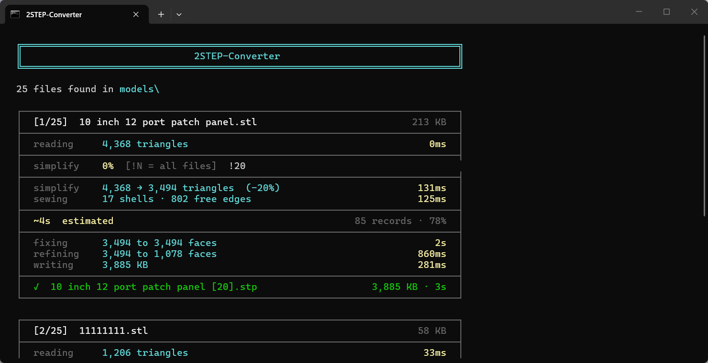

# 2STEP-Converter

> Converts **STL, 3MF, OBJ, AMF, and IGES** files to clean STEP solids using OpenCASCADE - the same engine that powers FreeCAD, CATIA, and other professional CAD tools.




---

The name has a deliberate double meaning. **"to STEP"** - whatever format you throw at it, the output is always a clean STEP file. **"two steps"** - drop your files into `models/` and run the launcher. No command line, no configuration required.

Most online converters wrap the mesh as-is into a STEP container, leaving thousands of flat triangular faces instead of real solid geometry. 2STEP-Converter sews the mesh into a proper solid, repairs it, and merges co-planar faces - the same pipeline FreeCAD uses internally.

**No installation required.** Everything downloads automatically on first run.


*Left: result from a typical online converter. Right: converted with 2STEP-Converter. Same source file.*

---

## Usage

### Batch mode

1. Drop your files into the `models/` folder
2. Run the launcher:
   - **Windows:** double-click `2STEP-Converter.bat`
   - **macOS / Linux:** `./2STEP-Converter.sh` (make executable once with `chmod +x 2STEP-Converter.sh`)
3. Output `.stp` files appear in the same folder

**Supported formats:** `.stl` `.3mf` `.obj` `.amf` `.igs` `.iges`

### Single file

**Windows**
```bat
2STEP-Converter.bat path\to\model.stl
2STEP-Converter.bat path\to\model.stl --output path\to\output.stp
```

**macOS / Linux**
```sh
./2STEP-Converter.sh path/to/model.stl
./2STEP-Converter.sh path/to/model.stl --output path/to/output.stp
```

### Multiple files

Pass any number of files directly - no need to use the `models/` folder:

**Windows**
```bat
2STEP-Converter.bat model1.stl model2.obj model3.3mf
```

**macOS / Linux**
```sh
./2STEP-Converter.sh model1.stl model2.obj model3.3mf
```

### Options

| Option | Default | Description |
|--------|:-------:|-------------|
| `--tolerance` / `-t` | `0.01` | Sewing tolerance in model units. Lower = tighter seams, slower. Increase if sewing fails on coarse meshes. |
| `--simplify` / `-s` | off | Reduce the mesh by this percentage before converting (e.g. `10` removes 10% of triangles, keeping 90%). |
| `--output` / `-o` | - | Output file path (single-file mode only). |
| `--output-dir` / `-d` | - | Write all outputs to this directory instead of alongside the source. |
| `--format` | `ap203` | STEP schema: `ap203`, `ap214`, or `ap242`. |
| `--force` / `-f` | off | Re-convert even if the output is already newer than the source. |
| `--dry-run` / `--dry` | off | Show what would be converted or skipped without doing anything. |
| `--watch` / `-w` | off | After the initial batch run, watch `models/` and convert new files as they appear. Ctrl+C to stop. |

**Windows**
```bat
2STEP-Converter.bat --simplify 25 model.stl
2STEP-Converter.bat --format ap214 --output-dir C:\exported model.stl
2STEP-Converter.bat --dry-run
2STEP-Converter.bat --watch
```

**macOS / Linux**
```sh
./2STEP-Converter.sh --simplify 25 model.stl
./2STEP-Converter.sh --format ap214 --output-dir ~/exported model.stl
./2STEP-Converter.sh --dry-run
./2STEP-Converter.sh --watch
```

---

## First Run

On first launch the launcher downloads everything automatically:

| Download | Size | Purpose |
|----------|:----:|---------|
| micromamba | ~10 MB | Portable Python environment manager |
| Python 3.12 + pythonocc-core | ~6 GB | OpenCASCADE bindings |
| trimesh + fast-simplification | ~50 MB | Optional mesh simplification |

### Install location

The launcher checks for an existing environment in this order:

1. `lib/` next to the script - used if present (portable mode)
2. Platform default - used if present
3. Neither found - you are asked where to install

| Platform | Default path |
|----------|-------------|
| Windows | `%LOCALAPPDATA%\STLtoSTP` |
| macOS | `~/Library/Application Support/STLtoSTP` |
| Linux | `~/.local/share/STLtoSTP` (respects `$XDG_DATA_HOME`) |

### Windows 260-character path limit

The Python environment contains deeply nested paths that can exceed Windows' default 260-character limit, causing silent failures. On startup the launcher detects this and offers two options:

| Option | What it does |
|--------|-------------|
| **[1] Enable long paths + reboot** | Writes `LongPathsEnabled = 1` to the registry via a UAC prompt, then reboots in 10 seconds. |
| **[2] Use %LOCALAPPDATA%\STLtoSTP** | Installs under your user profile where paths are shorter. No reboot needed. |

To enable long paths manually in an elevated PowerShell:

```powershell
Set-ItemProperty -Path "HKLM:\SYSTEM\CurrentControlSet\Control\FileSystem" -Name LongPathsEnabled -Value 1
```

Then reboot. This does not apply to macOS or Linux.

---

## How It Works

Replicates the FreeCAD **Part workbench** conversion pipeline:

| Step | Operation | OpenCASCADE API |
|:----:|-----------|-----------------|
| 0 | Simplify mesh (optional) | `trimesh` + `fast_simplification` |
| 1 | Read input mesh | `StlAPI_Reader`, `IGESControl_Reader` |
| 2 | Sew triangles into a watertight solid | `BRepBuilderAPI_Sewing` |
| 3 | Repair invalid geometry | `ShapeFix_Shape` |
| 4 | Merge co-planar faces | `ShapeUpgrade_UnifySameDomain` |
| 5 | Export STEP (AP203 / AP214 / AP242) | `STEPControl_Writer` |

---

## Configuration

All settings live in `data/config.json`, created automatically on first run. Edit it with any text editor.

```json
{
    "DEFAULT_TOLERANCE": 0.01,
    "DEFAULT_SIMPLIFY": 0,
    "DEFAULT_FORMAT": "ap203",
    "SIMPLIFY_INTERACTIVE": false,
    "ANGULAR_TOLERANCE": 0.001,
    "MODELS_DIR_NAME": "models"
}
```

| Key | Default | Description |
|-----|:-------:|-------------|
| `DEFAULT_TOLERANCE` | `0.01` | Sewing tolerance in model units. Controls how far apart two edges can be and still be joined. |
| `ANGULAR_TOLERANCE` | `0.001` | Angular tolerance (radians) for merging co-planar faces. ~0.06 deg - catches imprecise flat faces without over-merging. |
| `DEFAULT_SIMPLIFY` | `0` | Default reduction percentage. `10` removes 10% of triangles, keeping 90%. `0` disables. |
| `DEFAULT_FORMAT` | `"ap203"` | Default STEP schema: `ap203`, `ap214`, or `ap242`. Overridden by `--format` on the command line. |
| `SIMPLIFY_INTERACTIVE` | `false` | When `true`, prompts for a simplification percentage per file. Prefix with `!` (e.g. `!25`) to lock the value for all remaining files. |
| `MODELS_DIR_NAME` | `"models"` | Folder scanned for input files in batch mode. |
| `STL_EXT` | `".stl"` | STL input extension. |
| `TMF_EXT` | `".3mf"` | 3MF input extension. |
| `OBJ_EXT` | `".obj"` | OBJ input extension. |
| `IGS_EXT` | `".igs"` | IGES input extension (`.iges` also accepted). |
| `AMF_EXT` | `".amf"` | AMF input extension. |
| `STP_EXT` | `".stp"` | Output file extension. |

Invalid values are reported as warnings at startup and fall back to their defaults.

---

## Requirements

- Windows 10/11, macOS (Intel & Apple Silicon), or Linux (x86_64 & ARM64)
- Internet connection on first run only
- ~6 GB free disk space

Converted STEP files have been tested in **Plasticity** and import correctly.

---

## Project Structure

```
2STEP-Converter.bat       - launcher for Windows: auto-setup + run
2STEP-Converter.sh        - launcher for macOS / Linux: auto-setup + run
converter.py              - converter script
models/                   - drop input files here (.stl .3mf .obj .amf .igs .iges)
data/
  config.json             - tunable constants (auto-created on first run)
  estimator.json          - conversion time history for estimates (auto-created)
lib/                      - auto-created: portable Python environment
```

---

## Contributing

Contributions are welcome. Feel free to open a pull request, report issues, or fork and adapt the project to your own needs.

## License

[MIT](LICENSE.md) © 2026 [YaneonY](https://github.com/yaneony/2STEP-Converter)
